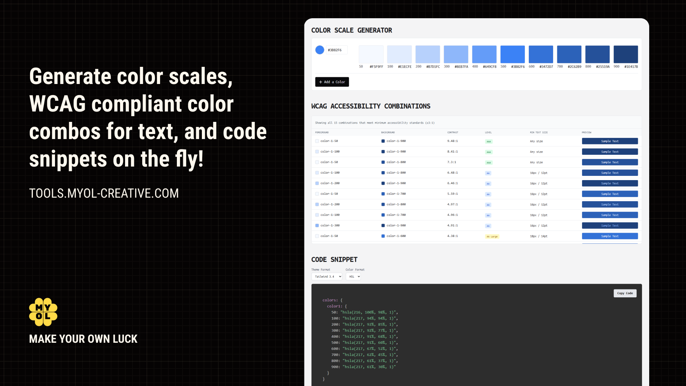

# Color Scale Generator

A web-based tool for building accessible color palettes and exporting them as
ready-to-paste code. Enter one or more base colors, get a perceptually even
10-shade ramp for each, check WCAG contrast across every shade, and export to
your design system — or copy the swatches straight into Figma as vector. Part of
the **Designer Utils / MYOL Creative** suite.

Live at **<https://tools.myol-creative.com/>**. No backend — a fully static
Astro site; all math runs in the browser.

The suite is a **one-stop shop for design-system foundations**, all on **one
page**: a sticky nav jumps between the sections, one viewport range drives
every fluid scale, and the Export section turns the live state into one CSS /
Tailwind 4 / W3C Design Tokens file:

- **Color Scales** — everything below.
- **Type Scales** — pick your fonts first (curated zero-download system
  stacks from modernfontstacks.com, a curated Google Fonts list, your own
  stack, or a custom `@font-face` stylesheet URL for self-hosted fonts), then
  set a font size and modular-scale ratio at each viewport anchor and preview
  every step live in your chosen font.
- **Space & Grid** — a fluid spacing scale (T-shirt sizes 3xs–3xl on an 8pt
  grid by default, plus one-up pairs) and a matching column grid, with px and
  rem readouts.
- **Foundations** — the rest of the token layers: corner radii, T-shirt-sized
  border widths (grow the ladder as needed), a 5-level elevation ramp with a
  dark variant (shadow color pickable from any shade of your palette), and
  motion (durations + replayable easings).
- **Export** — your whole system in one file, live as you edit: CSS + dark
  mode (with any font `@import`s hoisted on top), Tailwind 4 `@theme`, a
  Markdown style guide, or W3C Design Tokens (DTCG 2025.10,
  Figma-importable). One-click copy or `.txt` download, hex/HSL/RGB color
  encoding, and an optional variable prefix (e.g. `--brand-blue-500`).

Everything you set lives in the URL hash
(`#p=<palette>&t=<type>&s=<space>&f=<foundations>`), so a shared link reopens
your exact system; old per-tool links (`/type#t=…`) still redirect and load.
The site follows your OS light/dark preference.

## ✨ Features

### 🎨 Color scale generation

-   Enter any base hex; it expands into a 10-step shade ramp (50–900).
-   Ramps are built in **OKLCH** (a perceptual color space) so steps are visually
    even and hue stays stable across the ramp. The base color you enter is always
    the **500** swatch; out-of-gamut targets are gamut-mapped (chroma reduced,
    hue preserved) rather than clamped.
-   Multiple scales at once. Name them yourself or let them auto-name from the
    hue (e.g. `blue`); reorder with up/down; bulk-create by pasting a hex list.
-   Click any swatch to copy its hex.

### ♿ WCAG accessibility checking

-   Pick a background; the tool lists every shade across every scale that's
    legible on it (contrast ≥ 3:1), grouped by tier:
    -   **AAA** — 7:1, passes at any text size
    -   **AA** — 4.5:1, body text at 16px+
    -   **AA Large** — 3:1, large text only (24px, or 18.66px bold)
-   Each result shows a live preview, the pairing name, and the exact ratio.

### 🖼 Copy to Figma as SVG

-   **Copy a scale**, **the whole palette**, or **the entire contrast grid** as
    an SVG of named, editable rectangles. It's written to the clipboard as
    vector, so pasting into Figma (or any vector tool) gives `id`-named layers
    (`blue-500`, `blue-50-on-blue-900`, …) — no rebuilding swatches by hand.

### 📋 Code export

One **Export** section for the whole suite — live from everything you set
above it — in four formats; copy with one click, or download the snippet as a
`.txt` file:

-   **CSS + Dark Mode** — `:root` variables plus a `prefers-color-scheme: dark`
    block with the ramp mirrored.
-   **Tailwind 4** — `@theme` tokens, plus a `.dark` override.
-   **Markdown style guide** — a Hex + HSL table per color with WCAG
    text-on-white/black notes and a Dark column.
-   **Design Tokens (DTCG 2025.10) JSON** — W3C Design Tokens with top-level
    `light` and `dark` groups, for Style Dictionary / Tokens Studio / Figma.
    Colors use the 2025.10 color-object `$value`
    (`colorSpace` / `components` / `alpha` / `hex`), which is what Figma's
    native variables importer expects.

Code formats (CSS / Tailwind) also let you pick the value encoding: **HEX**,
**HSL**, or **RGB** — and every format takes an optional variable prefix.

### 🔗 Share & persist

-   Your whole system lives in the URL hash
    (`#p=<palette>&t=<type>&s=<space>&f=<foundations>`), so editing updates
    the link live and a shared link reopens the exact state. Also autosaved
    to `localStorage` — come back later and the tool offers to restore your
    last session.

### 👁 Vision simulation

-   A fixed bottom bar simulates color blindness **page-wide** — protanopia,
    deuteranopia, tritanopia, achromatopsia — so you can sanity-check the whole
    palette as different viewers see it.

## 🚀 Getting started

Use it online at **<https://tools.myol-creative.com/>**, or run it locally.

### Local development

```bash
npm install
npm run dev      # dev server at http://localhost:4321
```

| Command | What it does |
| --- | --- |
| `npm run dev` | Start the Astro dev server at `http://localhost:4321`. |
| `npm run build` | Static production build. |
| `npm run preview` | Serve the built output locally. |
| `npx tsc --noEmit` | Strict type check (the build alone doesn't type-check). |
| `npx playwright test` | Run the end-to-end test suite. |

## 🛠 Built with

-   **Astro 5** — static site generation
-   **React 19** — the interactive island (`client:load`)
-   **TypeScript** — strict throughout
-   **Tailwind CSS 4** — CSS-first theming (no `tailwind.config`)
-   **Prism.js** — syntax highlighting in the export block
-   **Playwright** — end-to-end tests

All color and contrast math is hand-written in `src/utils/colorUtils.ts` — no
color library, on purpose. See [CLAUDE.md](./CLAUDE.md) for architecture and
conventions, and [PLAN.md](./PLAN.md) for tracked follow-up work.

## 🚢 Deploy

The site is static and tracks `main` — merge a PR and production rebuilds at
<https://tools.myol-creative.com/>.

## 🐛 Issues & feedback

Found a bug or have a feature request? Please
[open an issue](https://github.com/Samalmohanna1/designer-utils/issues) on GitHub.

---

Made with ❤️ for accessible web design
