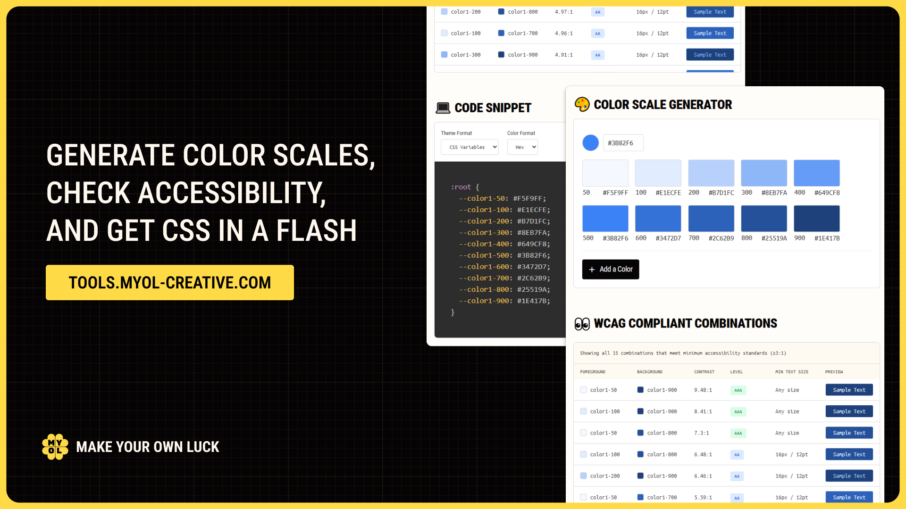

# Color Scale Generator

A powerful web-based tool for creating accessible color palettes and generating ready-to-use code snippets for your design system. Built with accessibility in mind, this tool automatically generates color scales, checks WCAG contrast compliance, and exports code in multiple formats.

## ✨ Features

### 🎨 Color Scale Generation

-   Input any base color and automatically generate a 10-shade color scale (50-900)
-   Smart algorithm creates harmonious color variations
-   Real-time preview of all generated shades
-   Support for multiple color scales in a single project

### ♿ WCAG Accessibility Testing

-   Automatic contrast ratio calculation for all color combinations
-   WCAG AAA and AA compliance checking
-   Visual indicators for accessibility levels:
    -   🔵 **AAA** (7:1 ratio) - Enhanced accessibility
    -   🟡 **AA Normal** (4.5:1 ratio) - Normal text
    -   🟢 **AA Large** (3:1 ratio) - Large text and UI elements
-   Combinations are sorted by accessibility level

### 📋 Code Export

Generate ready-to-use code snippets in multiple formats:

-   **Tailwind CSS 3.4** - Standard colors object
-   **Tailwind 4** - Modern @theme directive
-   **CSS Variables** - Universal :root variables

### 🎯 Color Format Support

Export colors in your preferred format:

-   **HEX** - `#3b82f6`
-   **HSL** - `hsla(217, 91%, 60%, 1)`
-   **RGB** - `rgb(59, 130, 246)`

## 🚀 Getting Started

### Online Tool

Visit [MYOL Tools](https://tools.myol-creative.com/) to use the tool directly in your browser.

## 📖 How to Use

### 1. Add Colors

-   Click the color picker or enter a hex value
-   Add multiple base colors to create comprehensive palettes
-   Each color automatically generates a 10-shade scale

### 2. Review Accessibility

-   Browse the contrast checker to see all color combinations
-   Sorted by WCAG compliance levels (AAA, AA, AA Large)
-   Each combination shows the contrast ratio and accessibility status

### 3. Export Code

-   Choose your preferred theme format (Tailwind 3.4, Tailwind 4, or CSS Variables)
-   Select color format (HEX, HSL, or RGB)
-   Copy the generated code snippet
-   Paste directly into your project

## 💻 Code Examples

### Tailwind CSS 3.4

```javascript
// tailwind.config.js
module.exports = {
	theme: {
		extend: {
			colors: {
				primary: {
					50: '#eff6ff',
					100: '#dbeafe',
					200: '#bfdbfe',
					300: '#93c5fd',
					400: '#60a5fa',
					500: '#3b82f6',
					600: '#2563eb',
					700: '#1d4ed8',
					800: '#1e40af',
					900: '#1e3a8a',
				},
			},
		},
	},
}
```

### Tailwind 4

```css
@theme {
	--primary-50: #eff6ff;
	--primary-100: #dbeafe;
	--primary-200: #bfdbfe;
	--primary-300: #93c5fd;
	--primary-400: #60a5fa;
	--primary-500: #3b82f6;
	--primary-600: #2563eb;
	--primary-700: #1d4ed8;
	--primary-800: #1e40af;
	--primary-900: #1e3a8a;
}
```

### CSS Variables

```css
:root {
	--primary-50: #eff6ff;
	--primary-100: #dbeafe;
	--primary-200: #bfdbfe;
	--primary-300: #93c5fd;
	--primary-400: #60a5fa;
	--primary-500: #3b82f6;
	--primary-600: #2563eb;
	--primary-700: #1d4ed8;
	--primary-800: #1e40af;
	--primary-900: #1e3a8a;
}
```

## 🎯 Use Cases

### Design Systems

-   Create consistent color palettes for your design system
-   Ensure all color combinations meet accessibility standards
-   Generate documentation-ready color scales

### Web Development

-   Quick Tailwind CSS color configuration
-   CSS custom properties for flexible theming
-   Accessibility-first color selection

### UI/UX Design

-   Validate color choices against WCAG guidelines
-   Explore accessible color combinations
-   Export developer-ready specifications

## ♿ Accessibility Features

This tool prioritizes accessibility in both its functionality and design:

-   **WCAG Compliance Testing**: All color combinations are automatically tested against WCAG 2.1 guidelines
-   **Clear Visual Indicators**: Accessibility levels are clearly marked with colors and text

## 🛠 Technical Details

### Built With

-   **Astro** - Static site generation
-   **React** - Interactive components
-   **TypeScript** - Type safety
-   **Tailwind CSS** - Styling
-   **Prism.js** - Syntax highlighting

### Browser Support

-   Chrome 88+
-   Firefox 85+
-   Safari 14+
-   Edge 88+

## 🐛 Issues & Feedback

Found a bug or have a feature request? Please [open an issue](https://github.com/Samalmohanna1/designer-utils/issues) on GitHub.

---

Made with ❤️ for accessible web design
